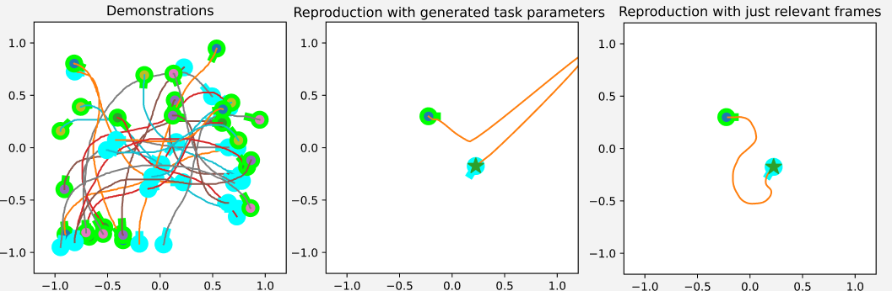
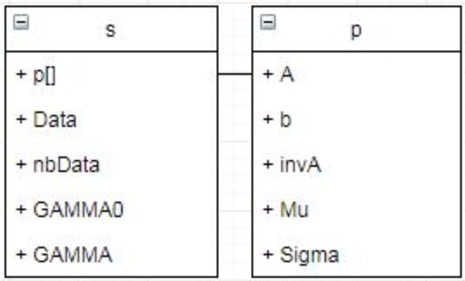
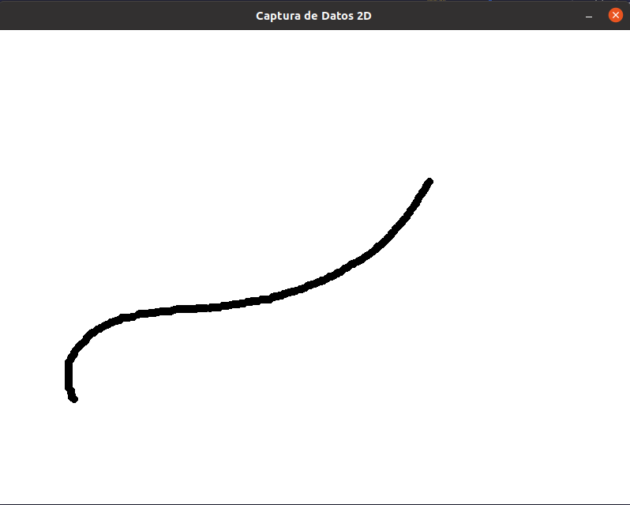
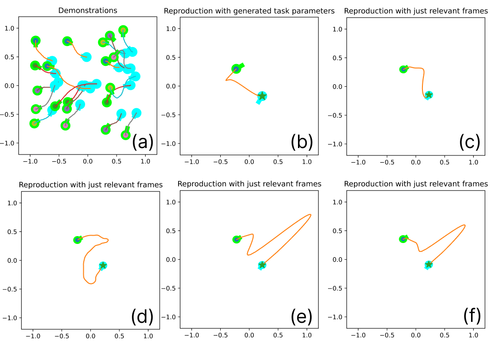

# **f-Divergence Optimization for Task-Parameterized Learning from Demonstrations Algorithm**
<p align="center">
  
</p>

In this project, we present a demonstration-based learning algorithm based on TPGMM and optimization through the use of an f-Divergence model (specifically, we will use the Kullback-Leibler). This algorithm features a detector for irrelevant frames to generalize a learned policy for tasks not demonstrated by users. The algorithm relies on detecting redundant and irrelevant frames and filtering them out. To achieve this, the algorithm iteratively obtains the probabilistic values of an initial solution considering all frames as relevant. Based on these values, it autonomously iterates, seeking the threshold that optimizes the solution by searching for the solution of minimum energy.

# Installation
To be used on your device, follow the installation steps below.

**Requierements:**
- Python 3.10.0 or higher


## Install miniconda (highly-recommended)
It is highly recommended to install all the dependencies on a new virtual environment. For more information check the conda documentation for [installation](https://conda.io/projects/conda/en/latest/user-guide/install/index.html) and [environment management](https://conda.io/projects/conda/en/latest/user-guide/tasks/manage-environments.html). For creating the environment use the following commands on the terminal.

```bash
conda create -n klTPGMM python=3.10.0 numpy=1.24.2 scipy=1.9.3 matplotlib=1.5.3 pygame=2.1.3
conda activate klTPGMM
```

## Install repository
Clone the repository in your system.
```bash
git clone https://github.com/AdrianPrados/TAICHI.git
```


# Usage
The algorithm requires a set of data to function. You can either use pre-recorded data (separated into different folders) or record your own using any data acquisition algorithm. We provide a simple way to do this using `DrawData.py`. The data of the TPGMM is stored in a proper format, as presented in the image:
<p align="center">
  
</p>
where s is a sample class and p is a parameters class. List of samples should be initialized and each sample object should have raw data recorded in reference to general frame in NxM format, number of Data points which is equals to M, and matrix of parameter objects in LxM format, where N is a number of variables, M is a number of data points and L is a number of frames in a workspace. Each column in parameters matrix corresponds to same column in Data matrix, i.e. parameter points and data points were recorded simultaneously and each column of them corresponds to the same time moment. GAMMA and GAMMA0 fields should not be initialized by user and they will be filled and used in future calculations by algorithm. So in general user have to create parameters matrix and raw data matrix to initialize sample.

Parameter class have A matrix, b matrix, A inverse matrix and number of states fields. Each parameter object corresponds to specific time step and specific frame of reference. Rows of parameter object matrix defines frames and columns defines time steps. For example, at first time step, first frame was at (2,3) coordinate from general origin and had 45 degrees of rotation about general origin: so user have to create parameter object and put it in first row of parameter matrix since it is first frame and Nth column where N defines recording moment point, b matrix field of that object should be ```np.array([[0, 2, 3]]).T column vector```, A matrix field of that object should be ```np.array([[1, 0, 0],[0, 0.7, -0.7],[0, 0.7, 0.7]])``` [(rotation matrix)](https://en.wikipedia.org/wiki/Rotation_matrix). Please, note that for time dimension we put 0 in b vector and 1 followed by 0s in first row of A matrix always, because we have no dependency of trajectory on time.

### **Data Acquisition**
For data acquisition you have to run the `DrawData.py`:

``` bash
python DrawData.py
```
This will open a window where you can draw the trajectory of the robot as is presented in the image:
<p align="center">
  
</p>
The data is collected by holding down the left button, and to end, it must be marked with the right button at the final point. The length of the data is filtered based on the set limit. It is necessary to adjust the data acquisition number to avoid overwriting. This algorithm stores the data directly in the format required and explained previously in Usage.

### **Execution**
Once the data is correctly stored, the algorithm can be launched. 
``` bash
python KL-TPGMM.py
```
It is necessary for `samples` to be equal to the number of data points taken, and `data` to be the length of the data (which should always be common for each of the paths taken). The user can modify the number of Gaussians used for the model using `nbStates`, bearing in mind that a higher number will result in longer execution time.

To choose the starting and ending points, a data format similar to an image (640,480) is used, and the orientations are stored in the values of DX and DY for the initial and final points. An example can be seen in the following code:

```python
if __name__ == "__main__":
    #Initial and final points
    C_img = [260,180]
    C_final = [380,275]
    #Initial and final orientations
    DX_TP = 0.05
    DY_TP = 0.03
    DX_TPF = -0.03
    DY_TPF = -0.05
    distance = 100 #Distance to the final point 
    direction = True #True for Left2Right, False for Right2Left
    main(C_img,C_final,DX_TP,DY_TP,DX_TPF,DY_TPF,direction,distance)
```
An example of the final result can be seen in the following image, where we find that there is a better generalization of the trajectory for one case, solution presented in frame (c) (with a low energy cost), and the irrelevant frames have been filtered out:

<p align="center">
  
</p>

# Citation
If you use this code, please quote our works :blush:

At the moment, pending of acceptance in a conference. :seedling:
